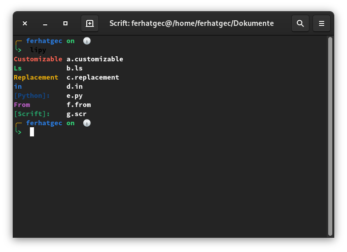

# Li[dot]Py
## Li[dot]Py, Python3 implementation of Scrift's list-directory command.



### Syntax
```rust
>'Customizable '< >"customizable"< >{91}<
>'Ls           '< >"ls"< >{92}<
>'Replacement  '< >"replacement"< >{93}<
>'in           '< >"in"< >{94}<
>'From         '< >"from"< >{95}<
```

### Features:
 * Written in Python.
 * Customizable.
 * and 'Colorize everything' philosophy taken from Scrift shell.

### Implementations
 * [Lirs](https://github.com/ferhatgec/lirs)
 * [Scrift](https://github.com/ferhatgec/scrift)

### Lipy (aka Li[dot]Py] licensed under the terms of MIT License.
